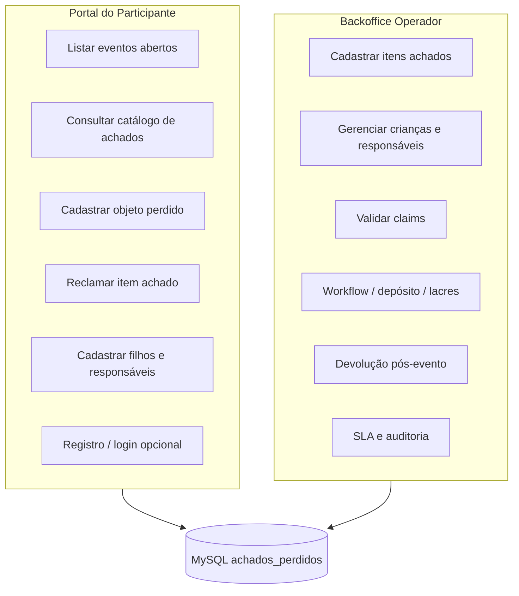

# Arquitetura — Portal do Participante vs Backoffice Operador

O sistema **Achados e Perdidos** atende dois públicos distintos no mesmo backend, com regras de segurança separadas.

## Visão geral



## Portal do participante (`/api/v1/portal`)

Público do evento: quem perdeu algo, quem reconhece um item na lista ou precisa cadastrar filhos.

| Tela / fluxo | Endpoint | Auth | Observação |
|--------------|----------|------|------------|
| Escolher evento | `GET /portal/eventos` | Não | Só eventos ativos com consulta pública ou claims habilitados |
| Detalhe do evento | `GET /portal/eventos/{id}` | Não | Flags `fgConsultaPublica`, `fgAceitaClaim` |
| Catálogo de achados | `GET /portal/eventos/{id}/itens` | Não | Exige `fgConsultaPublica=true` na config do evento |
| Cadastrar objeto perdido | `POST /portal/eventos/{id}/claims` | Não | Exige `fgAceitaClaim=true` |
| Reclamar item da lista | `POST /portal/eventos/{id}/claims/item` | Não | Cria claim + `claim_validacao` com status `PENDENTE` |
| Meus claims | `GET /portal/eventos/{id}/meus-claims` | JWT `PARTICIPANTE` | Filtra pelo e-mail do token |
| Cadastrar criança | `POST /portal/eventos/{id}/criancas` | Não | Mesmo payload do backoffice |
| Vincular responsável | `POST /portal/eventos/{id}/criancas/responsaveis` | Não | Mesmo payload do backoffice |
| Criar conta | `POST /portal/auth/registro` | Não | Perfil `Participante` |
| Login | `POST /api/v1/auth/login` | Não | Mesmo endpoint; retorna JWT com `ROLE_PARTICIPANTE` |

### Fluxo de claim pelo participante

1. Participante consulta o catálogo público de itens achados.
2. Identifica o objeto e envia `POST .../claims/item` com dados de contato.
3. Sistema cria `claim` e `claim_validacao` (`PENDENTE`).
4. Operador/atendente valida em `POST /api/v1/claims/validacoes` (backoffice).
5. Se aprovado, segue devolução em `POST /api/v1/devolucoes`.

### Configuração do evento

O operador habilita o portal por evento:

```http
PUT /api/v1/eventos/{id}/configuracao
{
  "fgConsultaPublica": true,
  "fgAceitaClaim": true
}
```

Sem registro persistido, o portal assume `fgConsultaPublica=false` e `fgAceitaClaim=true` (claims de objeto perdido funcionam; catálogo público não).

## Backoffice operador (`/api/v1/*`)

Área autenticada para equipe do evento (perfis `ADMIN`, `OPERADOR`, `ATENDENTE`, `CONSULTA`).

| Área | Perfis típicos | Endpoints |
|------|----------------|-----------|
| Cadastro de itens achados | Operador, Atendente | `POST /itens`, fotos em `/arquivos` |
| Crianças e responsáveis | Operador, Atendente | `/criancas`, `/criancas/responsaveis` |
| Claims e validação | Atendente, Admin | `/claims`, `/claims/validacoes` |
| Depósito e movimentação | Operador | `/depositos`, `/localizacoes`, `/workflow` |
| Lacres e contatos | Operador, Atendente | `/lacres`, `/contatos` |
| Devolução | Atendente | `/devolucoes` |
| Pós-evento / SLA | Operador, Admin | `/sla`, dashboard `/dashboard/*` |
| Auditoria | Admin | `/auditoria` |
| Usuários internos | Admin | `/usuarios` |

## Perfis e roles Spring

| Perfil no banco | Role JWT |
|-----------------|----------|
| Administrador | `ROLE_ADMIN` |
| Operador | `ROLE_OPERADOR` |
| Atendente | `ROLE_ATENDENTE` |
| Consulta | `ROLE_CONSULTA` |
| Participante | `ROLE_PARTICIPANTE` |

## Frontend sugerido (não implementado neste repositório)

### App portal (mobile-first ou PWA)

- Home com lista de eventos (`GET /portal/eventos`)
- Aba **Perdi algo** → formulário `POST .../claims`
- Aba **Itens achados** → grid com busca `GET .../itens`
- Detalhe do item → botão **Este é o meu** → `POST .../claims/item`
- Área **Meus filhos** → cadastro criança + responsável
- Login opcional para acompanhar claims (`meus-claims`)

### App backoffice (desktop/tablet)

- Login operador
- Painel do evento ativo (itens, claims pendentes, SLA)
- Telas já cobertas pelos módulos REST existentes

## Swagger

Grupo **Portal do Participante** documentado em `/swagger-ui.html` junto com os demais módulos.
